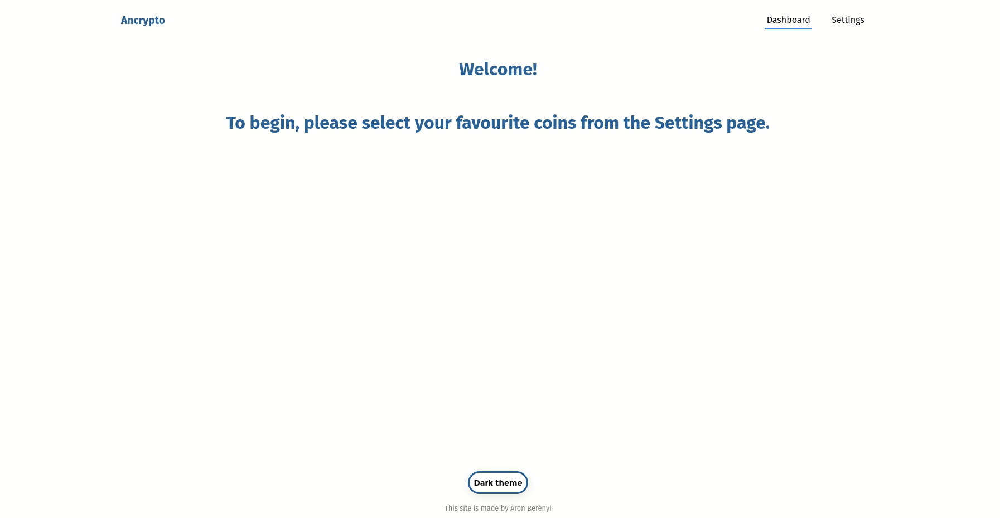

# Ancrypto
A React app to follow and check cryptocurrency prices. Select your favourites, and see the yearly, monthly, weekly, or daily price changes from the dashboard.

[Live demo](https://ancrypto.netlify.app/)

## Preview

## Technology

  * React
  * State is handled with Context API
  * Styling: Styled components
  * Cryptocompare API

### Description 

  I made this project as a reason to deepen my knowledge in React. I used Styled components for styling, and the site has a dark and a light theme. Actually the theme automatically changes to dark at night on page refresh. 

  The selected favourites are made persistent using localStorage. The search form uses a fuzzy algorythm, and the filtering call is debounced (meaning it fires automatically when you stop typing)

  I'm using React Hooks and functional components through the app.

## Available Scripts

In the project directory, you can run:

### `npm start`

Runs the app in the development mode. 
Open [http://localhost:3000](http://localhost:3000) to view it in the browser.

The page will reload if you make edits. 
You will also see any lint errors in the console.

### `npm run build`

Builds the app for production to the `build` folder. 
It correctly bundles React in production mode and optimizes the build for the best performance.

